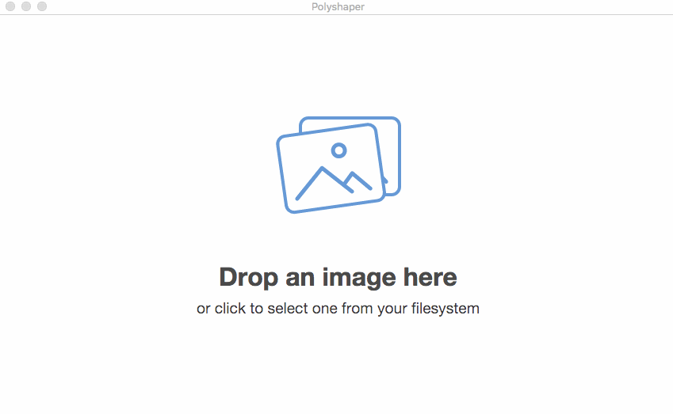
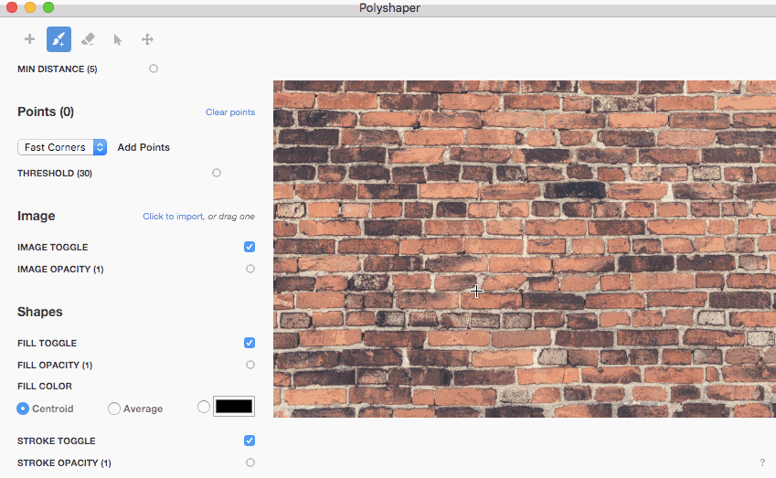
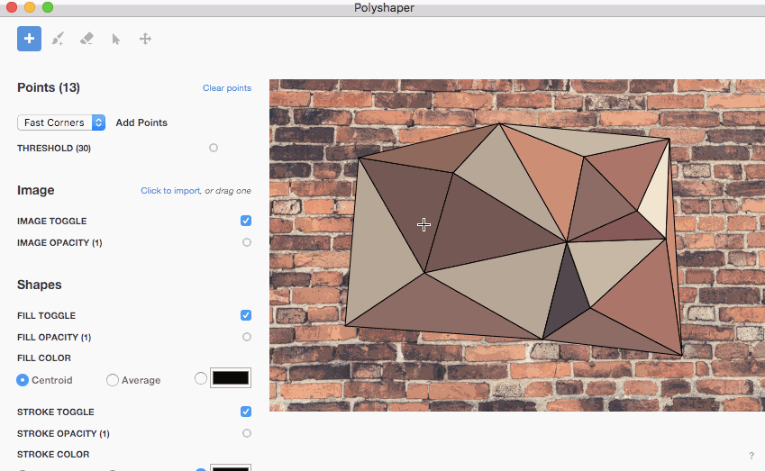

Once you've installed Polyshaper, the first thing is to import the image you want to work with.

## Import an Image

Just drag the image over the app, or click anywhere on the screen to pick one from tour filesystem.

## Start adding points

To start adding points by hand, first choose the proper Mouse Tool.
Note that until you have at least 3 points any shape will be displayed.

**Brush Tool**

**Add Point Tool**

If you are not convinced with some of the points you can get rid of them.
Just select the **Eraser Tool** and drag the mouse over them.

